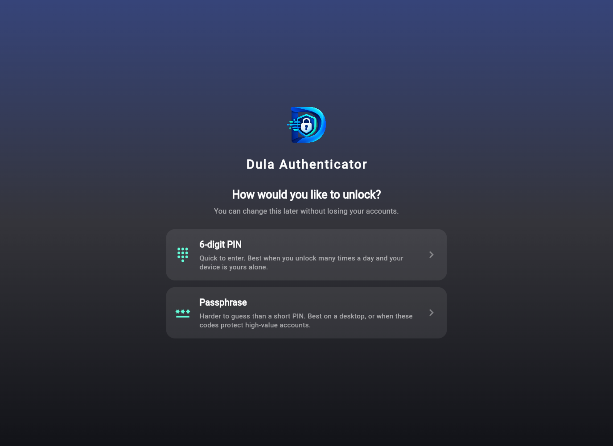
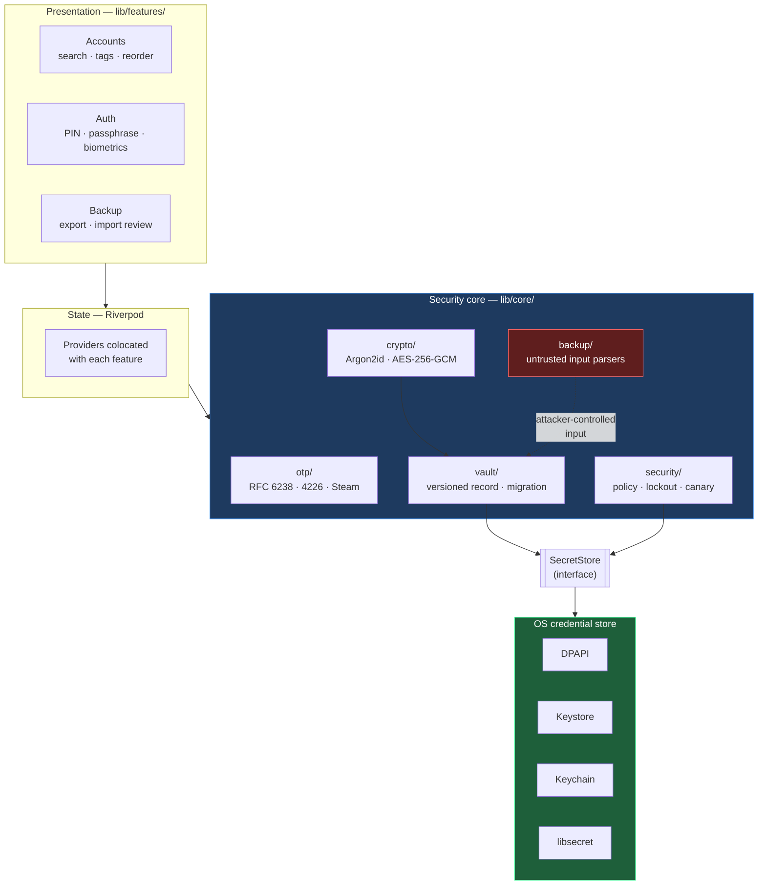
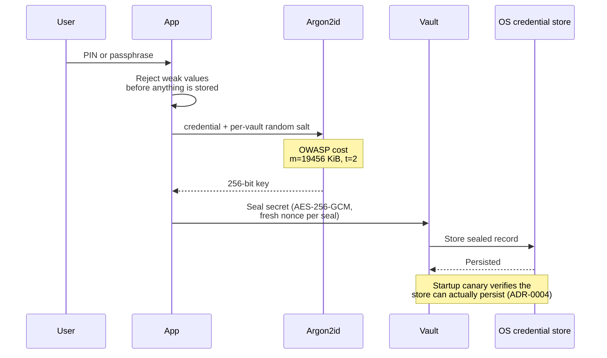

<div align="center">

# Dula Authenticator

**A cross-platform TOTP/HOTP authenticator that works where the others don't — air-gapped networks, camera-free offices, and desktops.**

[](LICENSE)
[](https://flutter.dev)
[](#platform-status)
[](#testing)
[](docs/adr/0007-air-gapped-operability.md)
[](docs/adr/)



</div>

---

No backend. No accounts. No telemetry. Codes are generated locally, and secrets never leave the
device — sealed with AES-256-GCM under an Argon2id-derived key, in the operating system's own
credential store.

## Why this exists

Most authenticator apps assume a personal phone with a camera and an internet connection. This one
is built for the cases where that assumption breaks.

| Constraint | How this handles it |
|---|---|
| **Air-gapped / restricted networks** | Zero outbound calls of any kind — no analytics, crash reporting, or update checks. Enforced as a project rule, not left to chance ([ADR-0007](docs/adr/0007-air-gapped-operability.md)) |
| **Offices banning phones or cameras** | Manual secret entry works on *every* platform; QR images can be pasted or dragged in where the OS supports it ([ADR-0006](docs/adr/0006-no-camera-enrollment-parity.md)) |
| **Desktop-first users** | Windows, Linux, and macOS are real targets, not afterthoughts |
| **Self-deployers** | App name, logo, colours, and security policy live in JSON — re-skinning needs no Dart changes ([BRANDING.md](docs/BRANDING.md), [CONFIGURATION.md](docs/CONFIGURATION.md)) |

## Architecture



> [!NOTE]
> `lib/core/backup/` is highlighted because it is the one place the app parses untrusted,
> attacker-controllable input — a scanned code or an imported file. It gets extra review scrutiny
> under the project's [security checklist](.claude/skills/security-review-mfa/SKILL.md).

### How a secret is sealed



## Features

<table>
<tr><td width="50%" valign="top">

**Codes**
- TOTP (RFC 6238) and HOTP (RFC 4226)
- Steam Guard's alphabet
- SHA-1 / SHA-256 / SHA-512
- Digits and period honoured from the
  `otpauth://` URI, not forced to defaults
  ([ADR-0012](docs/adr/0012-pluggable-otp-types.md))

</td><td width="50%" valign="top">

**Security**
- AES-256-GCM vault, Argon2id keys
  ([ADR-0010](docs/adr/0010-vault-cryptography-modernization.md))
- PIN **or** passphrase, chosen at setup
  ([ADR-0011](docs/adr/0011-authentication-and-unlock-model.md))
- Optional biometrics, credential always a fallback
- Lockout with escalating backoff
- Screenshot + root/jailbreak blocking on mobile
  ([ADR-0005](docs/adr/0005-device-integrity-scope.md))

</td></tr>
<tr><td valign="top">

**Getting accounts in**
- Camera scan, clipboard image, drag-and-drop,
  or manual entry — gated per platform by what
  each plugin actually supports
- Import from Google Authenticator, Aegis, 2FAS

</td><td valign="top">

**Living with them**
- Search, tags, favourites, drag-to-reorder, editing
- A corrupted account is isolated, not fatal to the list
  ([ADR-0015](docs/adr/0015-account-management.md))
- Encrypted local backup with its own passphrase —
  no cloud sync, by design
  ([ADR-0013](docs/adr/0013-backup-export-and-import.md))

</td></tr>
</table>

## Platform status

"Complete" means built, run, and covered by the automated suites on that platform — not aspiration.

| Platform | Status | Notes |
|---|:---:|---|
| **Windows** | ✅ Complete | Full unit + end-to-end suite runs here |
| **Android** | ✅ Complete | Verified on physical hardware — biometric unlock, camera enrollment, screenshot blocking |
| **Web** | ✅ Complete | Runs offline; see caveat below |
| **Linux** | 🚧 In progress | Builds and passes the full E2E suite, but a missing keyring daemon hangs startup instead of showing the intended error ([ADR-0017](docs/adr/0017-linux-secure-storage-isolate-freeze.md)) |
| **iOS** | 📦 Scaffolded | Not built or tested — needs macOS + Xcode |
| **macOS** | 📦 Scaffolded | Not built or tested — needs macOS + Xcode |

> [!WARNING]
> **Web has no OS credential store.** The vault is protected only by browser origin isolation. Treat
> the web build as a convenience and portability option, not a place to keep secrets that matter.
> This is stated plainly in [SECURITY_MODEL.md](docs/SECURITY_MODEL.md) rather than glossed over.

## Testing

| Suite | Count | Runs on |
|---|:---:|---|
| Unit / widget | **319** | Windows, Linux |
| End-to-end (`integration_test`) | **31** | Windows, Linux |

The end-to-end suite drives the real app: creating a vault, unlocking at production Argon2id cost,
generating codes for every OTP type, importing backups, and verifying that secrets are unreadable
without the right credential.

```bash
flutter test                                                   # unit + widget
flutter test integration_test/app_flow_test.dart -d windows    # or -d linux
```

## Building

```bash
flutter pub get
flutter analyze
flutter test

flutter build windows
flutter build apk
flutter build web
flutter build linux    # needs libgtk-3-dev, libsecret-1-dev, clang, cmake, ninja-build
flutter build macos    # macOS + Xcode only
flutter build ios      # macOS + Xcode only
```

Linux also needs a running secret-service keyring (`gnome-keyring` or `kwallet`) at runtime — see
[ADR-0004](docs/adr/0004-secure-storage-linux-keyring.md).

## Project layout

```
lib/
├── core/                      # cross-cutting, security-sensitive
│   ├── otp/                   # RFC 6238/4226 generation, otpauth:// parsing
│   ├── crypto/                # Argon2id derivation, AES-256-GCM sealing
│   ├── vault/                 # vault lifecycle, re-keying, SecretStore
│   ├── security/              # PIN/passphrase policy, lockout, Linux canary
│   ├── backup/                # export + Google Auth / Aegis / 2FAS parsers
│   ├── branding/              # runtime branding config
│   └── config/                # deployer-tunable security policy
└── features/                  # screens · providers · repositories · widgets
    ├── accounts/  auth/  backup/  home/  settings/

docs/
├── adr/                       # 17 Architecture Decision Records
├── SECURITY_MODEL.md          # threat model + per-platform capability matrix
├── CONFIGURATION.md           # every deployer-tunable setting
└── BRANDING.md                # re-skinning without touching Dart
```

## Design decisions

Every non-trivial decision is written down as an [Architecture Decision Record](docs/adr/) —
including the ones that turned out to be wrong.

[ADR-0017](docs/adr/0017-linux-secure-storage-isolate-freeze.md) is the one worth reading: real
Linux testing found that a missing keyring doesn't just fail, it *freezes the Dart isolate*. The
obvious fix — a timeout — was built, shipped, and then proven insufficient by a heartbeat timer that
stopped ticking anyway. The ADR records the failed fix and exactly why, instead of quietly deleting
the mistake.

Further reading: [SECURITY_MODEL.md](docs/SECURITY_MODEL.md) ·
[CONFIGURATION.md](docs/CONFIGURATION.md) · [BRANDING.md](docs/BRANDING.md) ·
[CLAUDE.md](CLAUDE.md)

## License

Apache License 2.0 — see [LICENSE](LICENSE) and [NOTICE](NOTICE).

Created and maintained by **Amanuel Feyissa Kussa**. Attribution must be retained in redistributions
and derivative works, per Section 4 of the license. Deployers are free to add their own
organization's branding alongside it.
