<div align="center">

# Dula Authenticator

**A cross-platform TOTP/HOTP authenticator that works where the others don't — air-gapped networks, camera-free offices, and desktops.**

[](https://github.com/AmanuelFeyissa/dula-authenticator/actions/workflows/ci.yml)
[](LICENSE)
[](https://flutter.dev)
[](#platform-status)
[](#testing)
[](docs/adr/0007-air-gapped-operability.md)
[](docs/adr/)

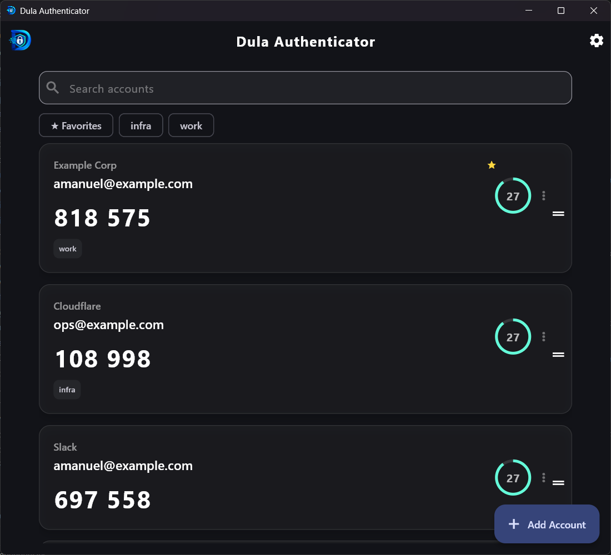

<sub>Windows desktop build. All accounts shown use throwaway demo secrets.</sub>

</div>

---

No backend. No accounts. No telemetry. Codes are generated locally, and secrets never leave the
device — sealed with AES-256-GCM under an Argon2id-derived key, in the operating system's own
credential store.

## Why this exists

Most authenticator apps assume a personal phone with a camera and an internet connection. This one
is built for the cases where that assumption breaks.

| Constraint | How this handles it |
|---|---|
| **Air-gapped / restricted networks** | Zero outbound calls of any kind — no analytics, crash reporting, or update checks. Enforced as a project rule, not left to chance ([ADR-0007](docs/adr/0007-air-gapped-operability.md)) |
| **Offices banning phones or cameras** | Manual secret entry works on *every* platform; QR images can be pasted or dragged in where the OS supports it ([ADR-0006](docs/adr/0006-no-camera-enrollment-parity.md)) |
| **Desktop-first users** | Windows, Linux, and macOS are real targets, not afterthoughts |
| **Self-deployers** | App name, logo, colours, and security policy live in JSON — re-skinning needs no Dart changes ([BRANDING.md](docs/BRANDING.md), [CONFIGURATION.md](docs/CONFIGURATION.md)) |

The camera-free claim, shown rather than stated — this is the desktop enrollment screen. A QR image
pasted from the clipboard fills the form on the left; the same form accepts a typed secret, with the
OTP type, algorithm, digits, and period/counter all editable, on the right.

<table>
<tr>
<td width="50%">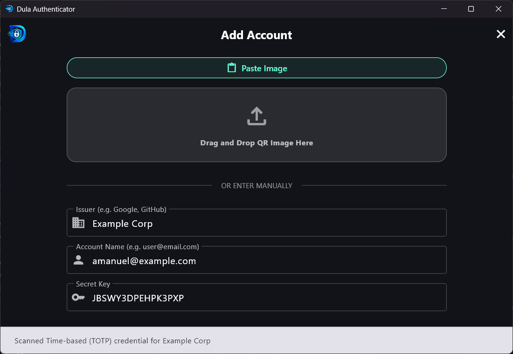</td>
<td width="50%">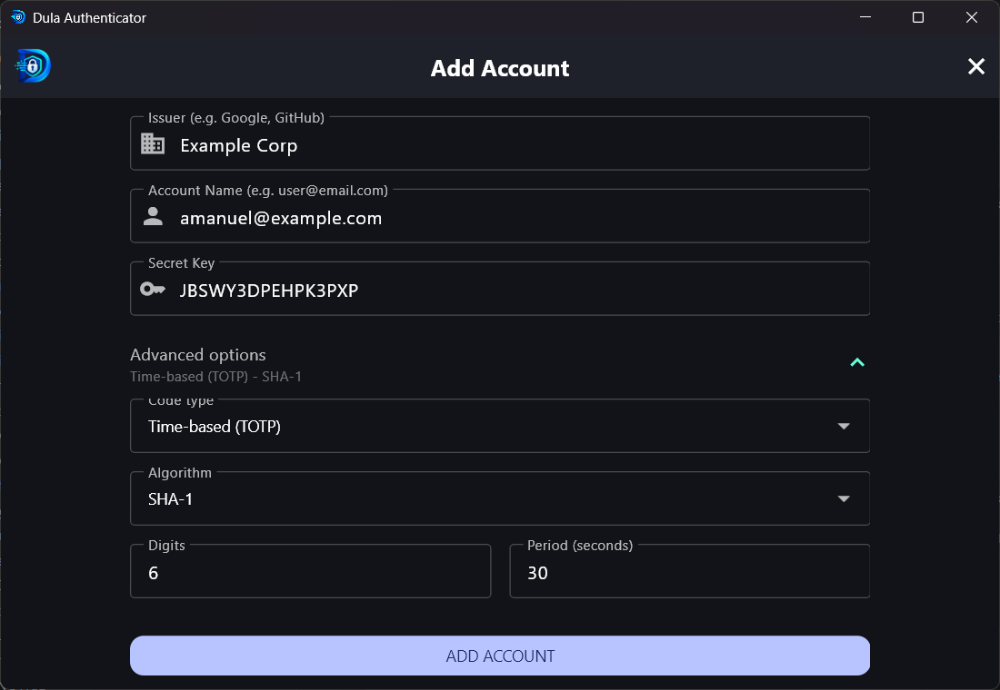</td>
</tr>
</table>

## Architecture

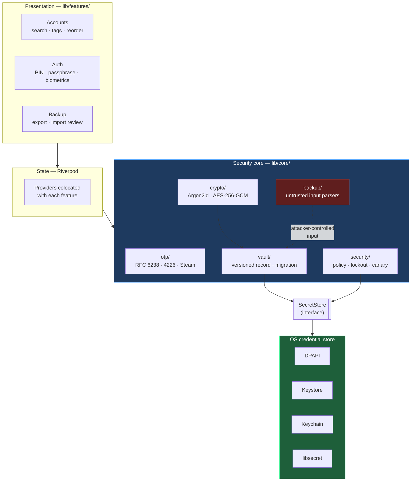
```mermaid
flowchart TB
    subgraph UI["Presentation — lib/features/"]
        Home["Accounts<br/>search · tags · reorder"]
        Auth["Auth<br/>PIN · passphrase · biometrics"]
        Backup["Backup<br/>export · import review"]
    end

    subgraph State["State — Riverpod"]
        Providers["Providers colocated<br/>with each feature"]
    end

    subgraph Core["Security core — lib/core/"]
        OTP["otp/<br/>RFC 6238 · 4226 · Steam"]
        Crypto["crypto/<br/>Argon2id · AES-256-GCM"]
        Vault["vault/<br/>versioned record · migration"]
        Sec["security/<br/>policy · lockout · canary"]
        Parse["backup/<br/>untrusted input parsers"]
    end

    Store[["SecretStore<br/>(interface)"]]

    subgraph OS["OS credential store"]
        direction LR
        W["DPAPI"]
        A["Keystore"]
        K["Keychain"]
        L["libsecret"]
    end

    UI --> State --> Core
    Crypto --> Vault --> Store --> OS
    Sec --> Store
    Parse -.->|"attacker-controlled<br/>input"| Vault

    style Core fill:#1e3a5f,stroke:#4a9eff,color:#fff
    style Parse fill:#5f1e1e,stroke:#ff6b6b,color:#fff
    style OS fill:#1e5f3a,stroke:#4affa0,color:#fff
```

> [!NOTE]
> `lib/core/backup/` is highlighted because it is the one place the app parses untrusted,
> attacker-controllable input — a scanned code or an imported file. It gets extra review scrutiny
> under the project's [security checklist](.claude/skills/security-review-mfa/SKILL.md).

### How a secret is sealed

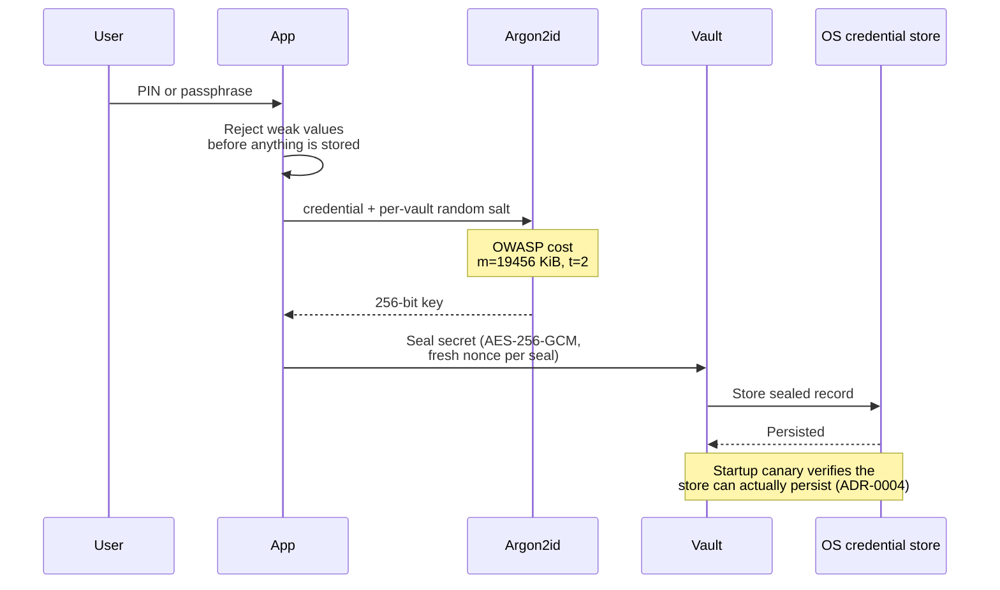
```mermaid
sequenceDiagram
    participant U as User
    participant A as App
    participant KDF as Argon2id
    participant V as Vault
    participant OS as OS credential store

    U->>A: PIN or passphrase
    A->>A: Reject weak values<br/>before anything is stored
    A->>KDF: credential + per-vault random salt
    Note over KDF: OWASP cost<br/>m=19456 KiB, t=2
    KDF-->>A: 256-bit key
    A->>V: Seal secret (AES-256-GCM,<br/>fresh nonce per seal)
    V->>OS: Store sealed record
    OS-->>V: Persisted
    Note over V,OS: Startup canary verifies the<br/>store can actually persist (ADR-0004)
```

## Features

<table>
<tr><td width="50%" valign="top">

**Codes**
- TOTP (RFC 6238) and HOTP (RFC 4226)
- Steam Guard's alphabet
- SHA-1 / SHA-256 / SHA-512
- Digits and period honoured from the
  `otpauth://` URI, not forced to defaults
  ([ADR-0012](docs/adr/0012-pluggable-otp-types.md))

</td><td width="50%" valign="top">

**Security**
- AES-256-GCM vault, Argon2id keys
  ([ADR-0010](docs/adr/0010-vault-cryptography-modernization.md))
- PIN **or** passphrase, chosen at setup
  ([ADR-0011](docs/adr/0011-authentication-and-unlock-model.md))
- Optional biometrics, credential always a fallback
- Lockout with escalating backoff
- Screenshot + root/jailbreak blocking on mobile
  ([ADR-0005](docs/adr/0005-device-integrity-scope.md))

</td></tr>
<tr><td valign="top">

**Getting accounts in**
- Camera scan, clipboard image, drag-and-drop,
  or manual entry — gated per platform by what
  each plugin actually supports
- Import from Google Authenticator, Aegis, 2FAS

</td><td valign="top">

**Living with them**
- Search, tags, favourites, drag-to-reorder, editing
- A corrupted account is isolated, not fatal to the list
  ([ADR-0015](docs/adr/0015-account-management.md))
- Encrypted local backup with its own passphrase —
  no cloud sync, by design
  ([ADR-0013](docs/adr/0013-backup-export-and-import.md))

</td></tr>
</table>

## Screenshots

Captured from the Windows release build. Every secret shown is a throwaway demo value.

<details open>
<summary><strong>First run and unlocking</strong></summary>
<table>
<tr>
<td width="50%"><br><sub>Choose a PIN or a passphrase at first run — changeable later without losing accounts (ADR-0011)</sub></td>
<td width="50%">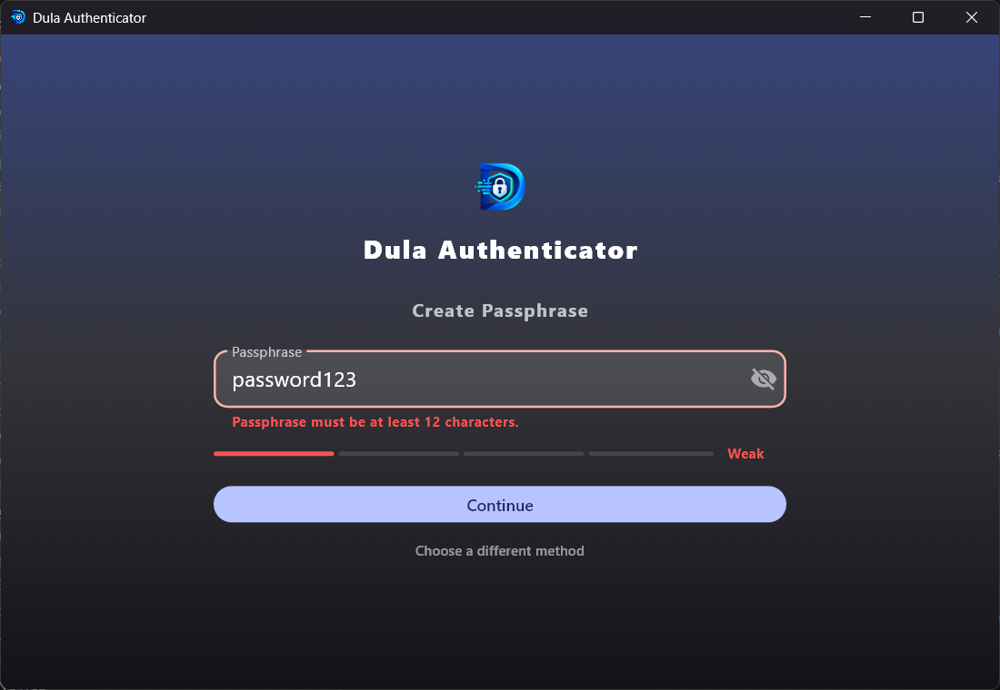<br><sub>Policy is enforced before anything is stored; the strength meter is advisory, the length rule is not</sub></td>
</tr>
<tr>
<td>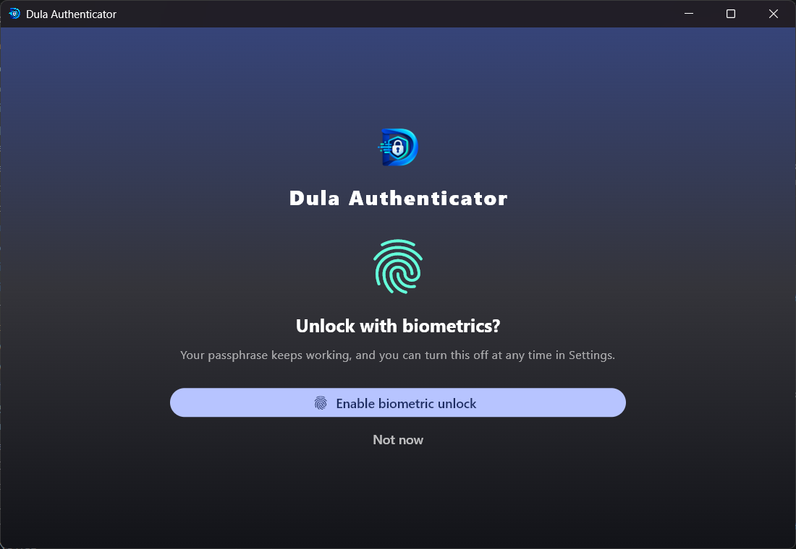<br><sub>Biometrics are opt-in and never the only way in — the credential always keeps working</sub></td>
<td>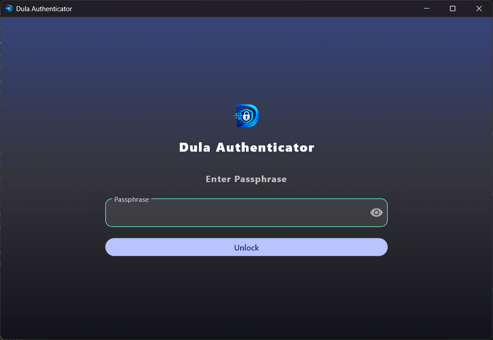<br><sub>Unlock screen. Wrong attempts escalate into a lockout with backoff</sub></td>
</tr>
</table>
</details>

<details>
<summary><strong>Codes and account management</strong></summary>
<table>
<tr>
<td width="50%">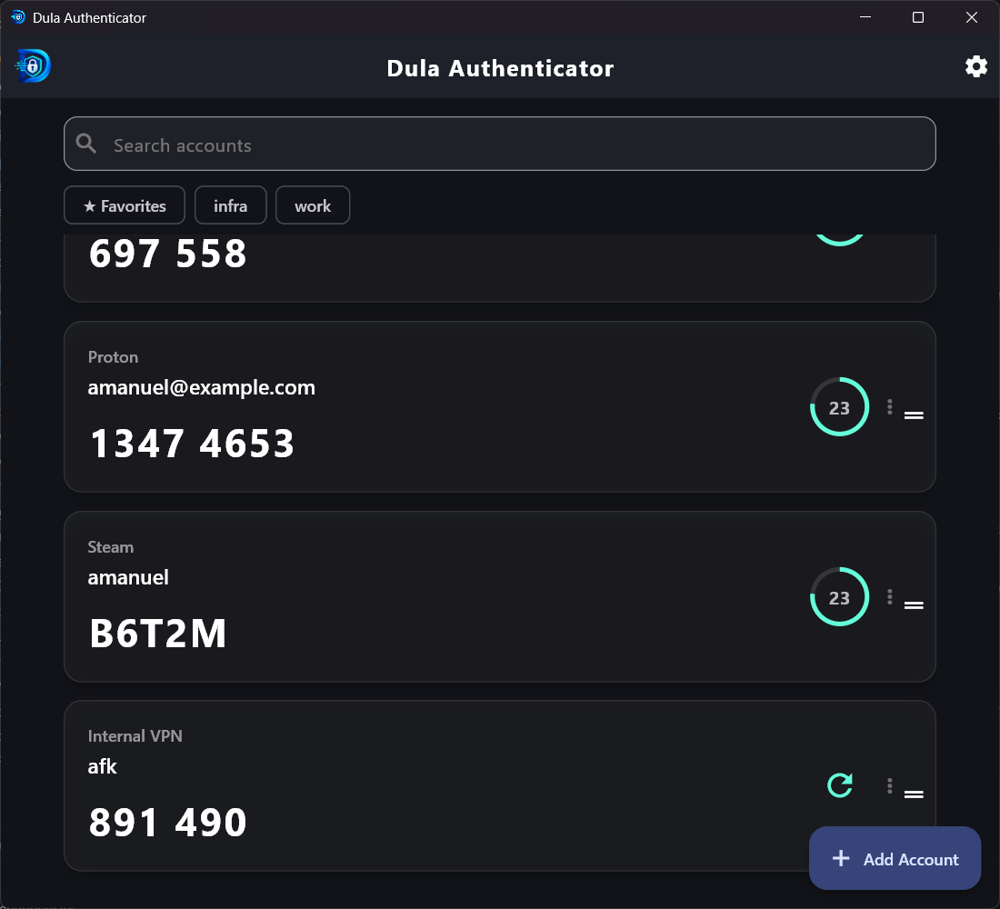<br><sub>One list, three generators: 8-digit TOTP, Steam Guard's 5-character alphabet, and counter-based HOTP with an advance button (ADR-0012)</sub></td>
<td width="50%">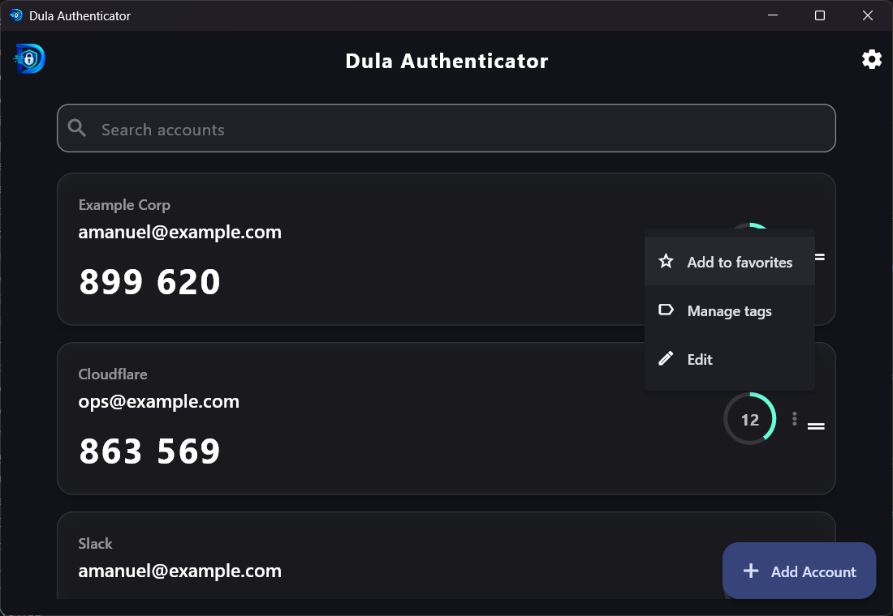<br><sub>Per-account: favourite, tags, edit. Drag handle on the right for reordering (ADR-0015)</sub></td>
</tr>
<tr>
<td>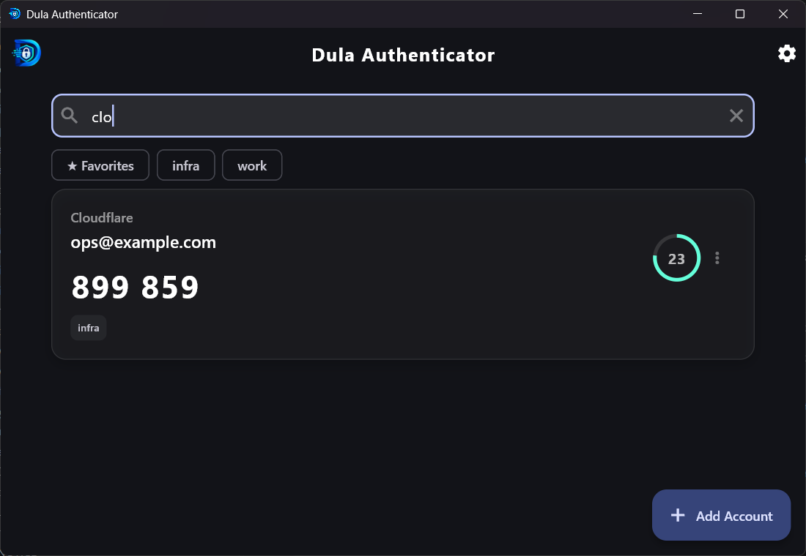<br><sub>Search matches issuer, account name, or tag; favourite and tag filters as chips</sub></td>
<td>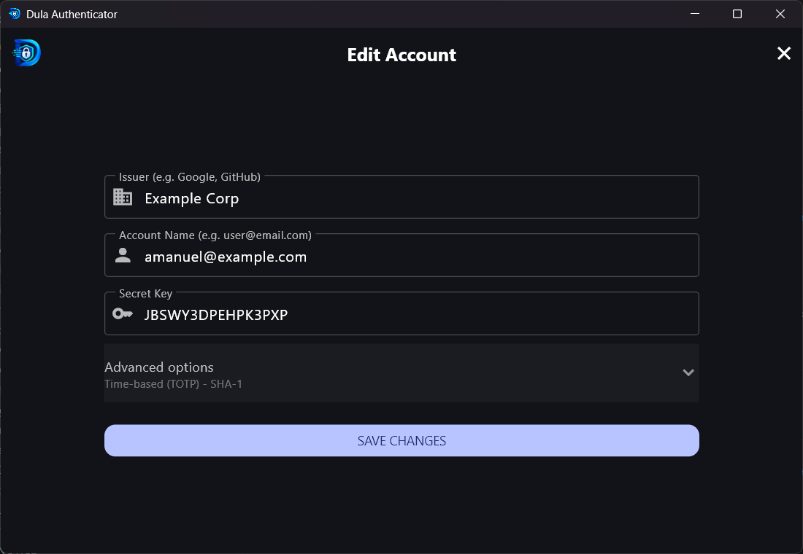<br><sub>Editing an existing account, including its OTP parameters — no delete-and-re-add</sub></td>
</tr>
</table>
</details>

<details>
<summary><strong>Settings, backup, and import</strong></summary>
<table>
<tr>
<td width="50%">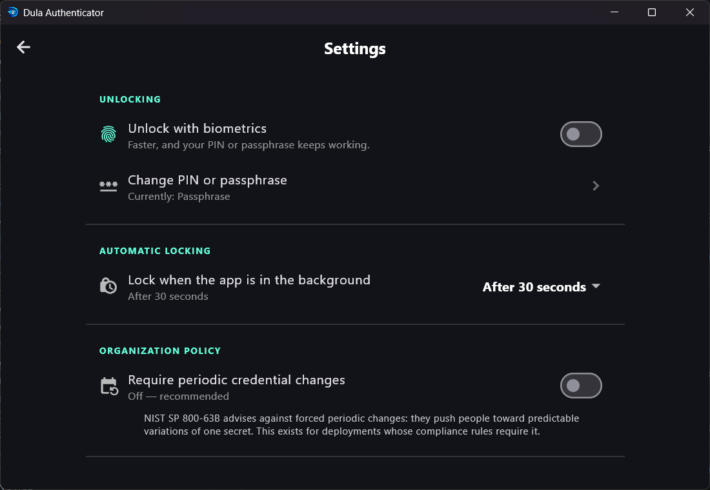<br><sub>Biometrics toggle, credential change, auto-lock. The forced-rotation option ships off, with the NIST reasoning printed next to it</sub></td>
<td width="50%">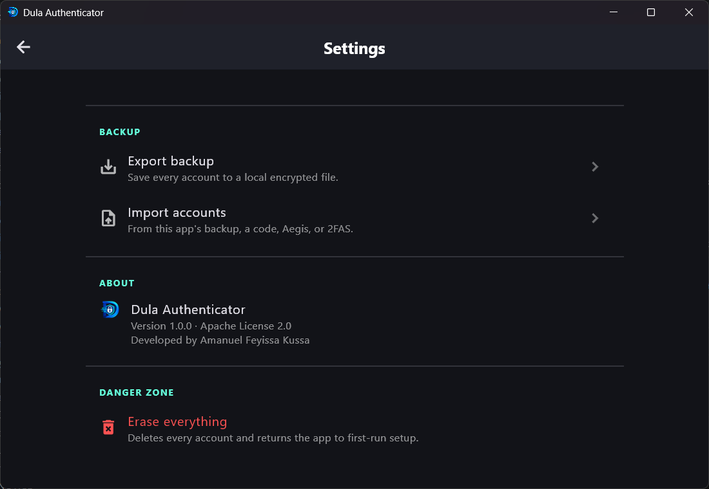<br><sub>Backup, attribution, and a clearly separated danger zone</sub></td>
</tr>
<tr>
<td>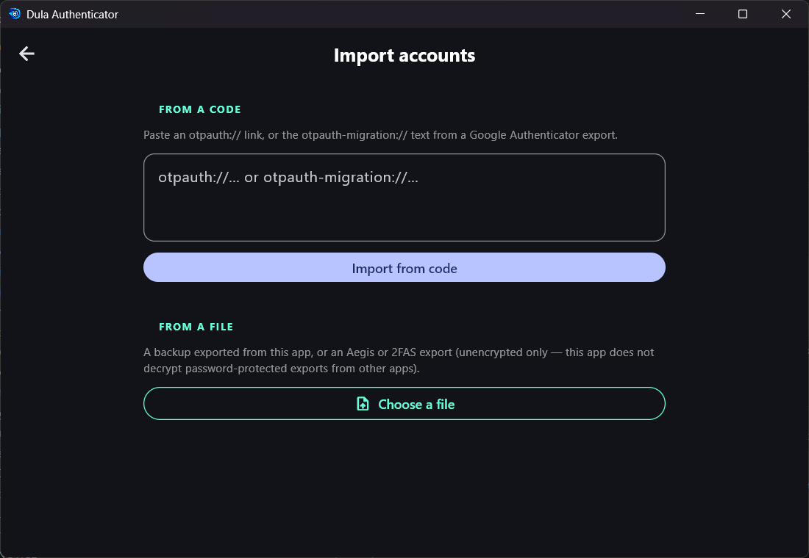<br><sub>Import from an <code>otpauth://</code> or Google Authenticator migration code, or from a file exported by this app, Aegis, or 2FAS</sub></td>
<td>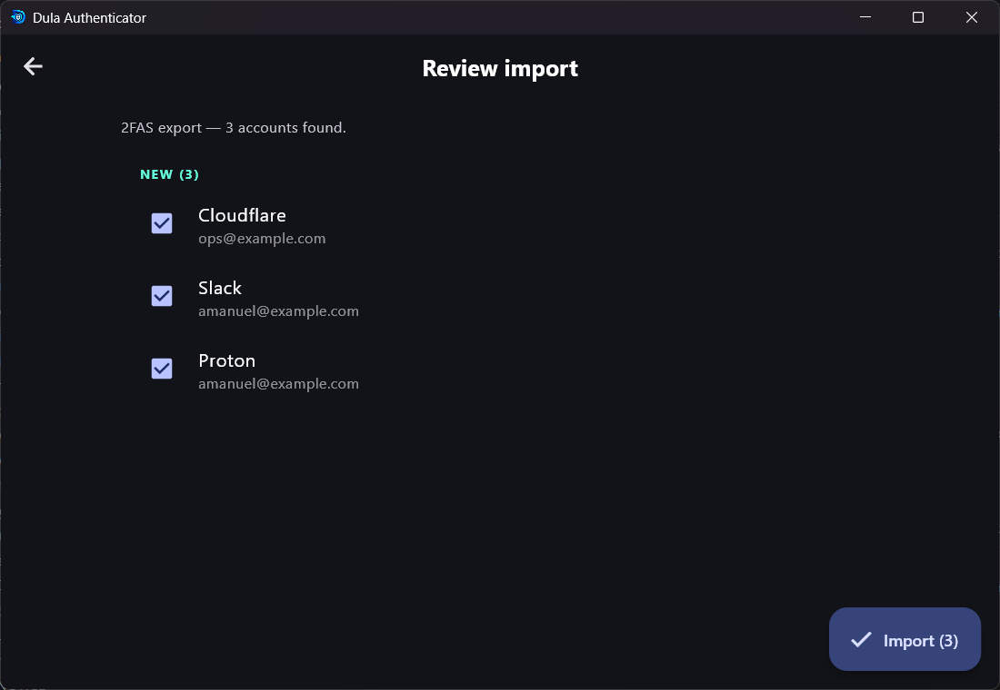<br><sub>Source detected automatically; every account is reviewed and selectable before anything touches the vault (ADR-0013)</sub></td>
</tr>
<tr>
<td>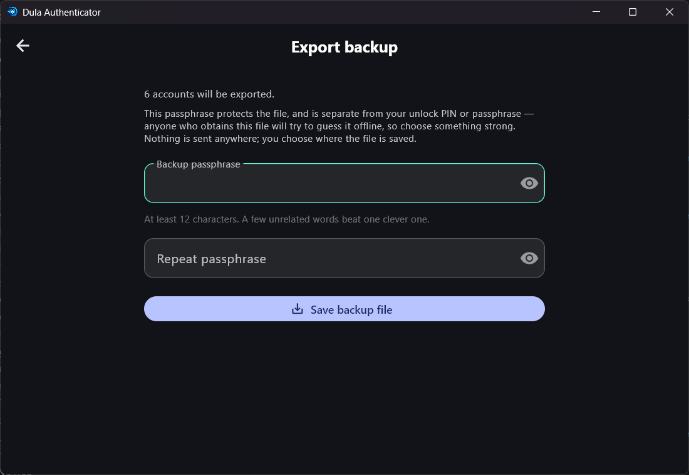<br><sub>Export uses its own passphrase, separate from the unlock credential, and explains why</sub></td>
<td>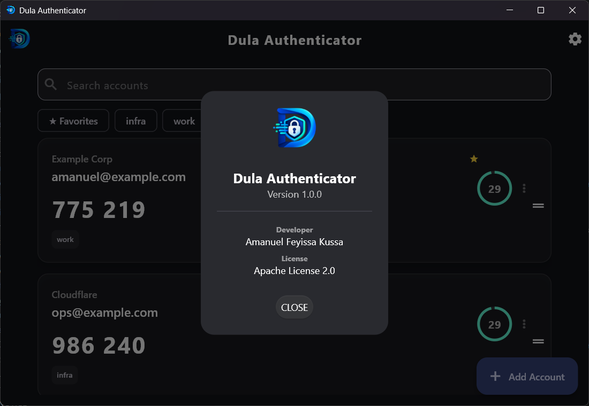<br><sub>About dialog — version, author, license</sub></td>
</tr>
</table>
</details>

## Platform status

"Complete" means built, run, and covered by the automated suites on that platform — not aspiration.

| Platform | Status | Notes |
|---|:---:|---|
| **Windows** | ✅ Complete | Full unit + end-to-end suite runs here |
| **Android** | ✅ Complete | Verified on physical hardware — biometric unlock, camera enrollment, screenshot blocking |
| **Web** | ✅ Complete | Runs offline; see caveat below |
| **Linux** | ✅ Complete | Full E2E suite passes under Xvfb; a missing keyring daemon now shows the intended error within seconds instead of hanging ([ADR-0018](docs/adr/0018-linux-secret-service-gate.md)). Packaging (AppImage / .deb / .rpm) is the next phase |
| **iOS** | 📦 Scaffolded | Not built or tested — needs macOS + Xcode |
| **macOS** | 📦 Scaffolded | Not built or tested — needs macOS + Xcode |

> [!WARNING]
> **Web has no OS credential store.** The vault is protected only by browser origin isolation. Treat
> the web build as a convenience and portability option, not a place to keep secrets that matter.
> This is stated plainly in [SECURITY_MODEL.md](docs/SECURITY_MODEL.md) rather than glossed over.

## Testing

| Suite | Count | Runs on |
|---|:---:|---|
| Unit / widget | **337** | Windows, Linux |
| End-to-end (`integration_test`) | **31** + 2 Linux-only keyring proofs | Windows, Linux |

The end-to-end suite drives the real app: creating a vault, unlocking at production Argon2id cost,
generating codes for every OTP type, importing backups, and verifying that secrets are unreadable
without the right credential.

```bash
flutter test                                                   # unit + widget
flutter test integration_test/app_flow_test.dart -d windows    # or -d linux
```

Every push and pull request runs the analyzer and unit suite on **Ubuntu and Windows**, builds all
four shipping targets, and replays both Linux keyring scenarios plus the full end-to-end suite
against a real `gnome-keyring` — see [`.github/workflows/ci.yml`](.github/workflows/ci.yml).
`flutter analyze` is a zero-tolerance gate, infos included, and `dart format` is enforced.

> [!NOTE]
> Run `dart format .` before committing. A couple of deliberately hand-grouped regions are marked
> `// dart format off`. The tree was reformatted in one mechanical commit, listed in
> [`.git-blame-ignore-revs`](.git-blame-ignore-revs) — run
> `git config blame.ignoreRevsFile .git-blame-ignore-revs` once so `git blame` skips past it.

## Building

```bash
flutter pub get
flutter analyze
flutter test

flutter build windows
flutter build apk
flutter build web
flutter build linux    # needs libgtk-3-dev, libsecret-1-dev, clang, cmake, ninja-build
flutter build macos    # macOS + Xcode only
flutter build ios      # macOS + Xcode only
```

Linux also needs a running secret-service keyring (`gnome-keyring` or `kwallet`) at runtime — see
[ADR-0004](docs/adr/0004-secure-storage-linux-keyring.md).

### Linux packages

```bash
flutter build linux --release
./packaging/linux/build-packages.sh            # all three, into dist/
./packaging/linux/build-packages.sh deb        # or just one
```

| Format | Why it exists | Needs |
|---|---|---|
| **AppImage** | The air-gapped path: one file, no install step, no package manager, no network. Copy it onto a USB drive, `chmod +x`, run it | `appimagetool` |
| **`.deb`** | Debian/Ubuntu fleets managed through an internal mirror | `dpkg-dev` |
| **`.rpm`** | Fedora/RHEL-family fleets | `rpm` (`rpmbuild`) |

Flatpak is a deferred stretch goal and Snap is permanently out of scope — the Snap Store backend is
closed and cannot be self-hosted, which defeats the point for the adopters this targets
([ADR-0008](docs/adr/0008-linux-packaging.md)).

> [!WARNING]
> None of the Linux packages are sandboxed. The AppImage in particular runs with the full
> permissions of whoever launches it — it is not a Flatpak. See
> [SECURITY_MODEL.md](docs/SECURITY_MODEL.md).

## Project layout

```
lib/
├── core/                      # cross-cutting, security-sensitive
│   ├── otp/                   # RFC 6238/4226 generation, otpauth:// parsing
│   ├── crypto/                # Argon2id derivation, AES-256-GCM sealing
│   ├── vault/                 # vault lifecycle, re-keying, SecretStore
│   ├── security/              # PIN/passphrase policy, lockout, Linux canary
│   ├── backup/                # export + Google Auth / Aegis / 2FAS parsers
│   ├── branding/              # runtime branding config
│   └── config/                # deployer-tunable security policy
└── features/                  # screens · providers · repositories · widgets
    ├── accounts/  auth/  backup/  home/  settings/

docs/
├── adr/                       # 18 Architecture Decision Records
├── SECURITY_MODEL.md          # threat model + per-platform capability matrix
├── CONFIGURATION.md           # every deployer-tunable setting
└── BRANDING.md                # re-skinning without touching Dart
```

## Design decisions

Every non-trivial decision is written down as an [Architecture Decision Record](docs/adr/) —
including the ones that turned out to be wrong.

[ADR-0017](docs/adr/0017-linux-secure-storage-isolate-freeze.md) and
[ADR-0018](docs/adr/0018-linux-secret-service-gate.md) are the pair worth reading. Real Linux
testing found that a missing keyring doesn't just fail, it *freezes the app*. A timeout was built
and proven insufficient by a heartbeat timer that stopped ticking anyway; a background-isolate
probe was built and proven insufficient too. Reading the plugin's C++ explained both: it makes a
*synchronous* libsecret call on the platform thread — the thread the Dart UI isolate lives on. The
fix that works asks D-Bus whether the service exists *before* ever calling into it. Both failed
attempts stay in the record, with the reason each could not have worked.

Further reading: [SECURITY_MODEL.md](docs/SECURITY_MODEL.md) ·
[CONFIGURATION.md](docs/CONFIGURATION.md) · [BRANDING.md](docs/BRANDING.md) ·
[CLAUDE.md](CLAUDE.md)

## License

Apache License 2.0 — see [LICENSE](LICENSE) and [NOTICE](NOTICE).

Created and maintained by **Amanuel Feyissa Kussa**. Attribution must be retained in redistributions
and derivative works, per Section 4 of the license. Deployers are free to add their own
organization's branding alongside it.
